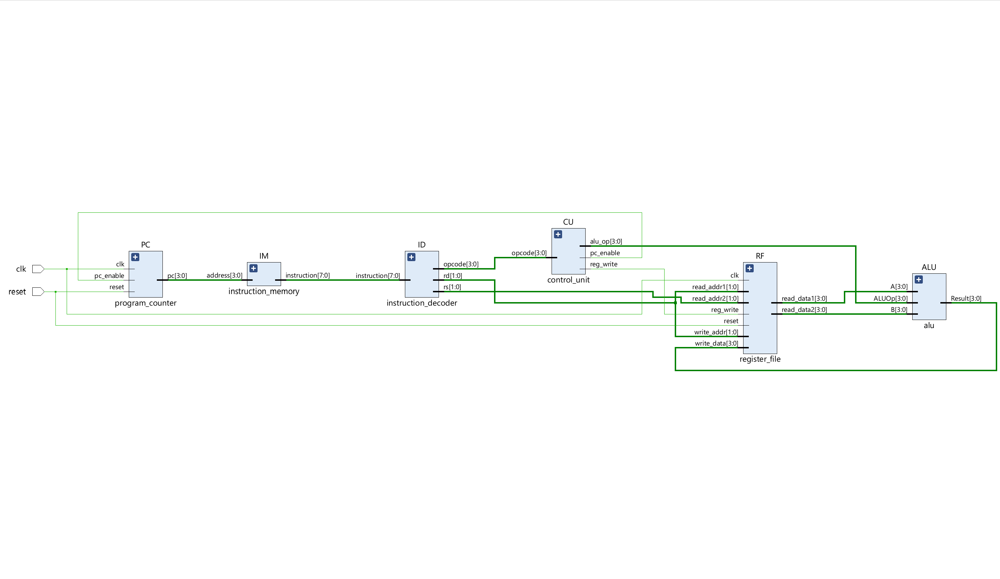
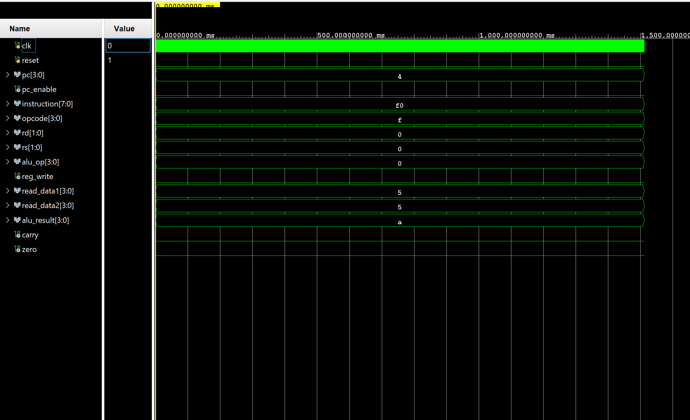
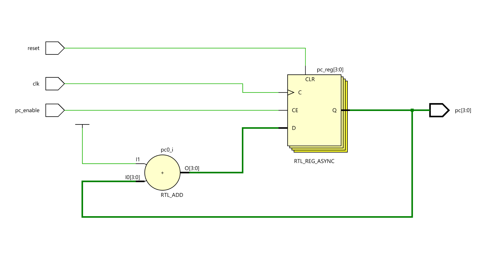
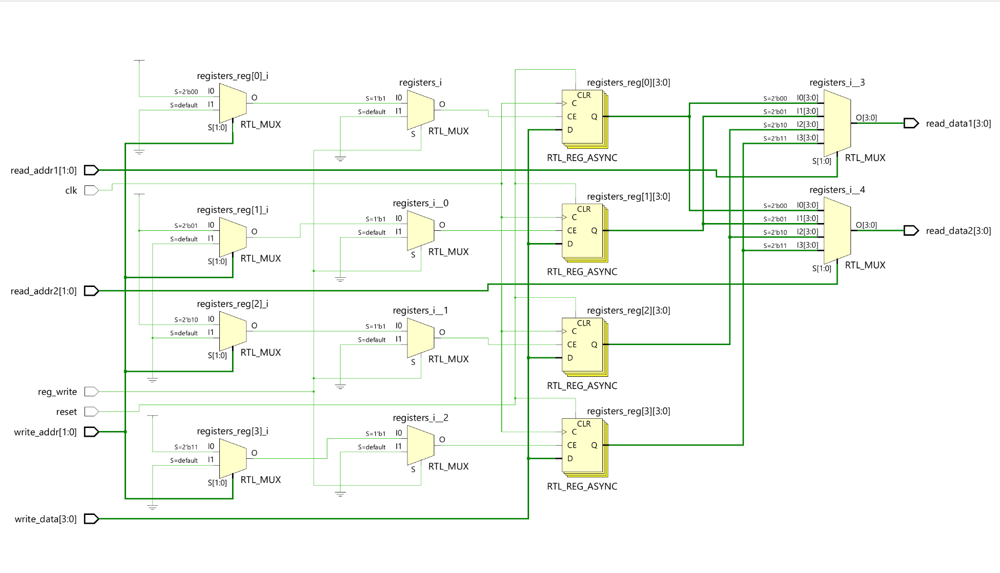
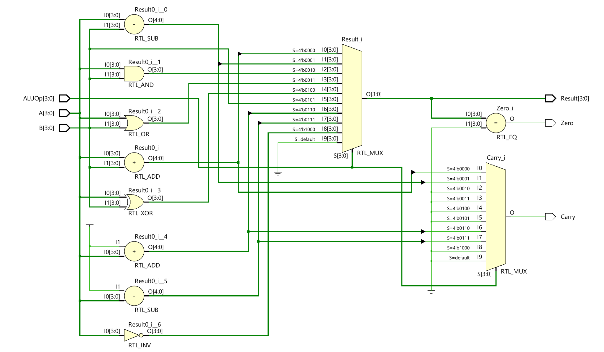

# Design and Verification of a 4-Bit Processor Using Verilog HDL


---

## Overview

This project presents the RTL design, simulation, and functional verification of a custom **4-bit single-cycle processor** developed using **Verilog HDL** and verified using **AMD Vivado 2025.2**.

The processor was designed following a modular datapath architecture and implements the fundamental stages of processor operation:

- Instruction Fetch
- Instruction Decode
- Execute
- Write Back

The project was developed as a **self-directed learning project** to gain practical experience in:

- Processor Architecture
- RTL Design
- Verilog HDL
- Functional Verification
- Digital System Integration

---

## Processor Datapath Architecture

.png)

The processor consists of the following major modules:

- Program Counter (PC)
- Instruction Memory (IM)
- Instruction Decoder (ID)
- Control Unit (CU)
- Register File (RF)
- Arithmetic Logic Unit (ALU)

---

## Processor Features

- Custom 4-bit datapath architecture
- Single-cycle instruction execution
- Custom 8-bit Instruction Set Architecture (ISA)
- Four general-purpose 4-bit registers
- Arithmetic and logical instruction support
- Modular RTL design methodology
- Functional verification using simulation waveforms
- Scalable architecture for future extensions

---

## Instruction Format

| Bits | Description |
|------|-------------|
| [7:4] | Opcode |
| [3:2] | Destination Register (Rd) |
| [1:0] | Source Register (Rs) |

Instruction Width: **8 bits**

---

## Supported Instructions

| Opcode | Instruction | Operation |
|--------|------------|-----------|
| 0000 | ADD | Rd ← Rd + Rs |
| 0001 | SUB | Rd ← Rd − Rs |
| 0010 | AND | Rd ← Rd AND Rs |
| 0011 | OR | Rd ← Rd OR Rs |
| 0100 | XOR | Rd ← Rd XOR Rs |
| 0101 | MOV | Rd ← Rs |
| 0110 | INC | Rd ← Rd + 1 |
| 0111 | DEC | Rd ← Rd − 1 |
| 1000 | NOT | Rd ← NOT(Rd) |
| 1111 | HLT | Halt Processor Execution |

---

## Processor RTL Architecture



The RTL schematic generated by Vivado confirms successful integration of all processor modules and validates the datapath interconnections and control signal routing.

---

## Functional Verification

The processor functionality was verified using simulation in AMD Vivado 2025.2.



Simulation results validated:

- Sequential instruction fetching
- Instruction decoding
- Control signal generation
- ALU execution
- Register write-back
- Processor halt functionality

---

## Major RTL Modules

### Program Counter
- Generates instruction addresses
- Supports reset and halt operation



---

### Register File
- Four 4-bit general-purpose registers
- Dual-read and single-write architecture



---

### Arithmetic Logic Unit
- Performs arithmetic and logical operations
- Generates status flags



---

## Development Environment

| Parameter | Value |
|----------|-------|
| HDL | Verilog HDL |
| EDA Tool | AMD Vivado 2025.2 |
| Verification | Functional Simulation |
| Processor Type | Single-Cycle Processor |
| Data Width | 4-bit |
| Instruction Width | 8-bit |
| Register Count | 4 |
| Instruction Memory | 16 × 8 |
| ALU Operations | 9 |

---

## Repository Structure

```text
4-bit-processor-verilog/
│
├── src/
│   ├── program_counter.v
│   ├── instruction_memory.v
│   ├── instruction_decoder.v
│   ├── control_unit.v
│   ├── register_file.v
│   ├── alu.v
│   └── processor_top.v
│
├── testbench/
│   ├── pc_tb.v
│   ├── instruction_memory_tb.v
│   ├── instruction_decoder_tb.v
│   ├── control_unit_tb.v
│   ├── register_file_tb.v
│   ├── alu_tb.v
│   └── processor_tb.v
│
├── images/
│
├── report/
│   └── Project_Report_4_bit_Processor.pdf
│
├── README.md
└── LICENSE
```

---

## Technical Report

The complete project report containing:

- Architecture details
- RTL schematics
- Simulation waveforms
- Flowcharts
- Verification methodology
- Results and discussion

is available in:

```text
report/Project_Report_4_bit_Processor.pdf
```

---

## Future Improvements

Potential future enhancements include:

- Data Memory support
- Branch and Jump instructions
- Stack implementation
- Interrupt handling
- Pipeline architecture
- FPGA implementation on hardware
- Expansion to an 8-bit processor architecture

---

## Learning Outcomes

This project provided practical understanding of:

- Processor Datapath Design
- Instruction Set Architecture
- Control Signal Generation
- Register Organization
- RTL Development
- Functional Verification
- Digital Hardware Integration

---

## Author

**Shivam Chaurasiya**  
B.Tech in Electronics and Communication Engineering  
Electronics and VLSI Enthusiast

---

## License

This project is released under the MIT License.
